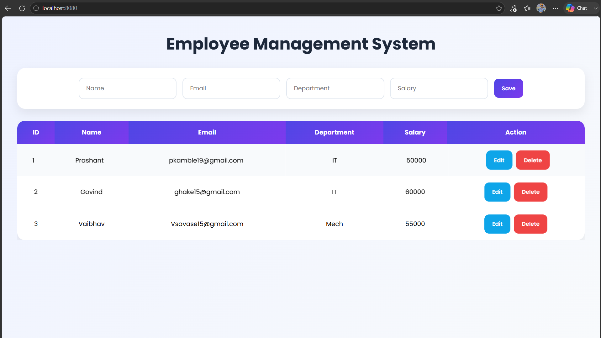
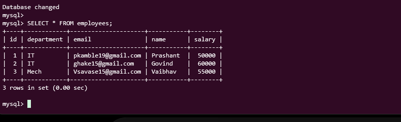
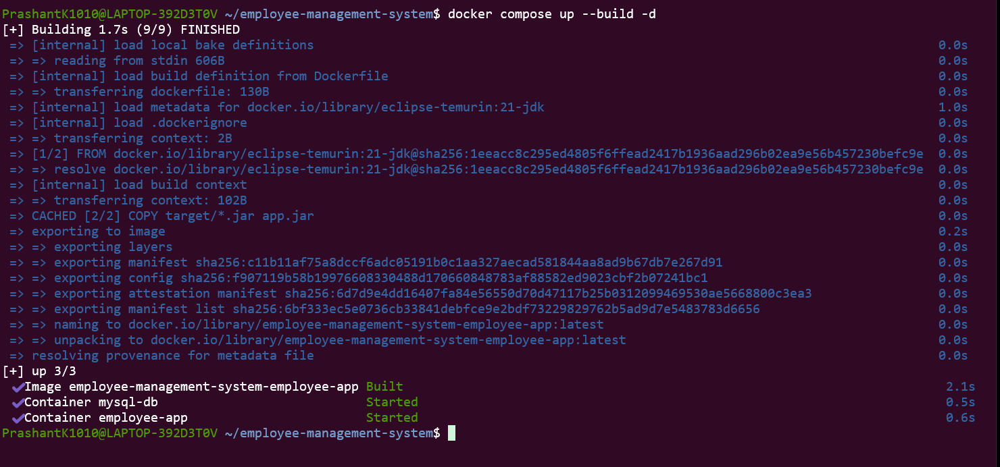
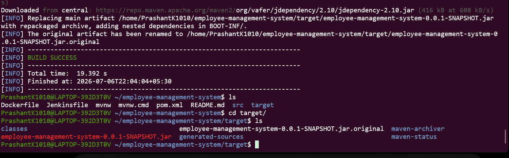
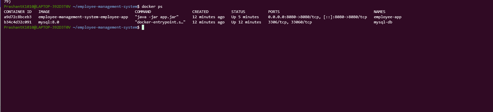

# Employee Management System

A Full Stack Employee Management System developed using Spring Boot, MySQL, HTML, CSS, and JavaScript. The application supports CRUD operations and is containerized using Docker for deployment on AlmaLinux 9.

---

## Features

- Add Employee
- View Employees
- Update Employee Details
- Delete Employee
- REST API Integration
- Responsive Frontend
- MySQL Database Connectivity
- Dockerized Application
- Docker Compose Deployment

---
## Application Screenshots

### Employee Management Dashboard


### MySQL Database Records


### Maven Build Success


### Jar File Creted


### Running Containers


---
## Tech Stack

### Backend
- Java 21
- Spring Boot
- Spring Data JPA
- Maven

### Frontend
- HTML
- CSS
- JavaScript

### Database
- MySQL 8

### DevOps
- Git
- GitHub
- Docker
- Docker Compose
- AlmaLinux 9 (WSL)

---

## Project Structure

```text
employee-management-system
│
├── src
│   ├── main
│   │   ├── java
│   │   ├── resources
│   │   └── static
│   │
│   └── test
│
├── target
├── Dockerfile
├── docker-compose.yml
├── pom.xml
└── README.md
```

---

## Local Setup

### Clone Repository

```bash
git clone https://github.com/Prashant-Kamble1010/employee-management-system.git

cd employee-management-system
```

### Configure Database

```sql
CREATE DATABASE employee_db;
```

Update application.properties

```properties
spring.datasource.url=jdbc:mysql://localhost:3306/employee_db
spring.datasource.username=root
spring.datasource.password=
```

### Run Application

```bash
mvn clean install

mvn spring-boot:run
```

Application URL

```text
http://localhost:8080
```

---

## Docker Deployment

### Build Project

```bash
mvn clean package -DskipTests
```

### Build Docker Image

```bash
docker build -t employee-app .
```

### Run Docker Container

```bash
docker run -d -p 8080:8080 employee-app
```

---

## Docker Compose Deployment

### Start Services

```bash
docker compose up --build -d
```

### Stop Services

```bash
docker compose down
```

---

## Deployment Workflow

```text
GitHub
   │
   ▼
AlmaLinux 9 (WSL)
   │
   ▼
Docker Compose
   │
   ├──────────────┐
   ▼              ▼

Spring Boot     MySQL
Container       Container

   │
   ▼

Employee Management System
```

---

## API Endpoints

### Get All Employees

```http
GET /api/employees
```

### Get Employee By Id

```http
GET /api/employees/{id}
```

### Create Employee

```http
POST /api/employees
```

### Update Employee

```http
PUT /api/employees/{id}
```

### Delete Employee

```http
DELETE /api/employees/{id}
```

---

## Achievements

- Developed Full Stack CRUD Application
- Implemented REST APIs using Spring Boot
- Integrated MySQL Database
- Containerized using Docker
- Deployed using Docker Compose
- Configured Container Networking
- Successfully deployed on AlmaLinux 9

---

## Author

Prashant Kamble

GitHub:
https://github.com/Prashant-Kamble1010
